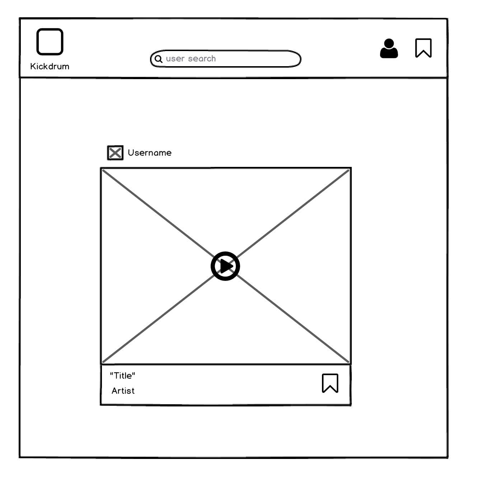
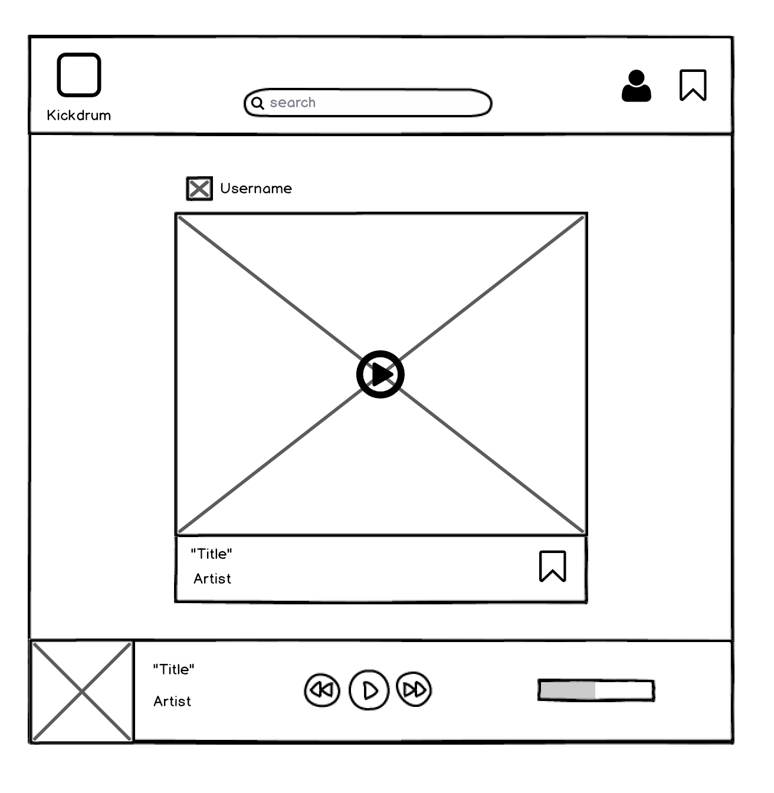
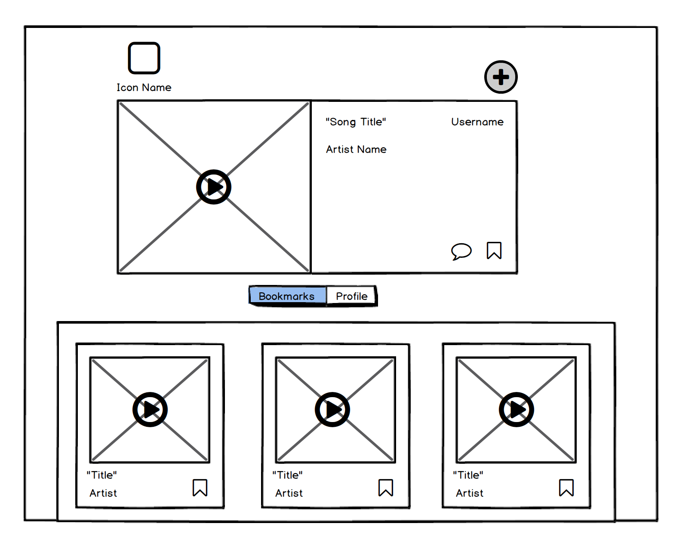

# KickDrum

[KickDrum Live][live] **NB:** This should be a link to your production site

[live]: hhttp://www.kickdrum.io

KickDrum is a full-stack web application inspired by Cymbal.fm.  It utilizes Ruby on Rails on the backend, a PostgreSQL database, and React.js with a Redux architectural framework on the frontend.  

## Features & Implementation

### Creating and Rendering Posts

  

  To create a new post, a user must provide basic info (`artist` and `title`) as well as a public `photo_url` of the album art and an mp3 link, `song_url`. All fields are required for creating a new post. Each post is stored in a Posts table which has a `user_id` for reference. Posts are rendered in four ways: as a PostIndexItem in the main feed (stream), as part of a grid view in user profile / user bookmarks, in a song player at the bottom of the page, and if a post is the most recent, in the ProfileHeader as a featured post. Upon navigating to each section, an API request is made to the posts database (with user params if necessary) to populate the specified component. In each postDetail, the post title, album, photo and bookmark button are displayed (see below:)

  

### Playing a Post

  In order to play the associated mp3 link for each post, users click the "play" icon which is visible onHover on a post's photo. Clicking the icon creates an event that renders the songPlayer at the bottom of the page which receives props from the post that was clicked. The player displays all the post attributes in addition to player controls and a progress bar.

  

### Bookmarks

Each render of a post includes a bookmarks button, which creates an association between a post and a user. users can bookmark any post, including their own. Bookmarks are used to make an API request to repopulate the postIndex grid view on the user's profile page with bookmarked posts instead of a list of their own posts.

