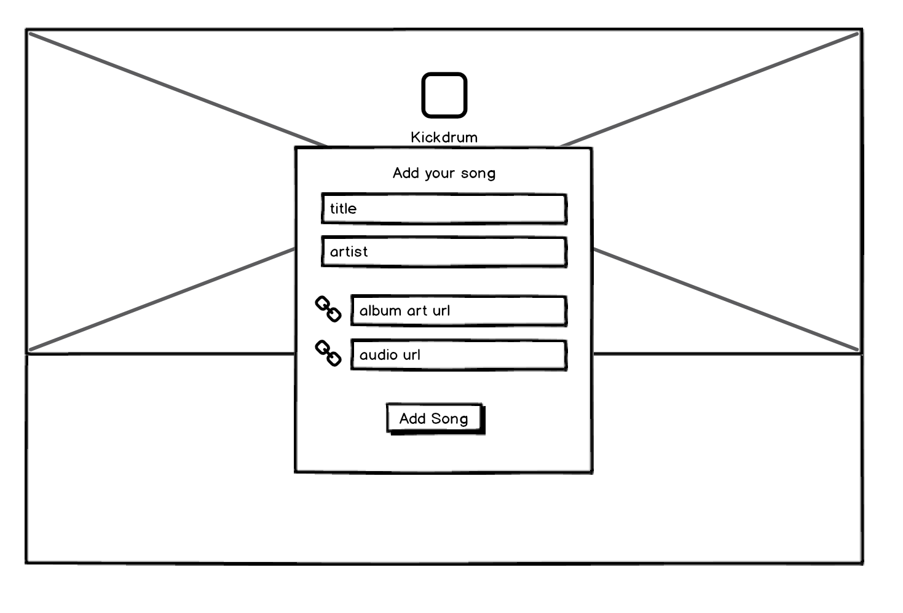
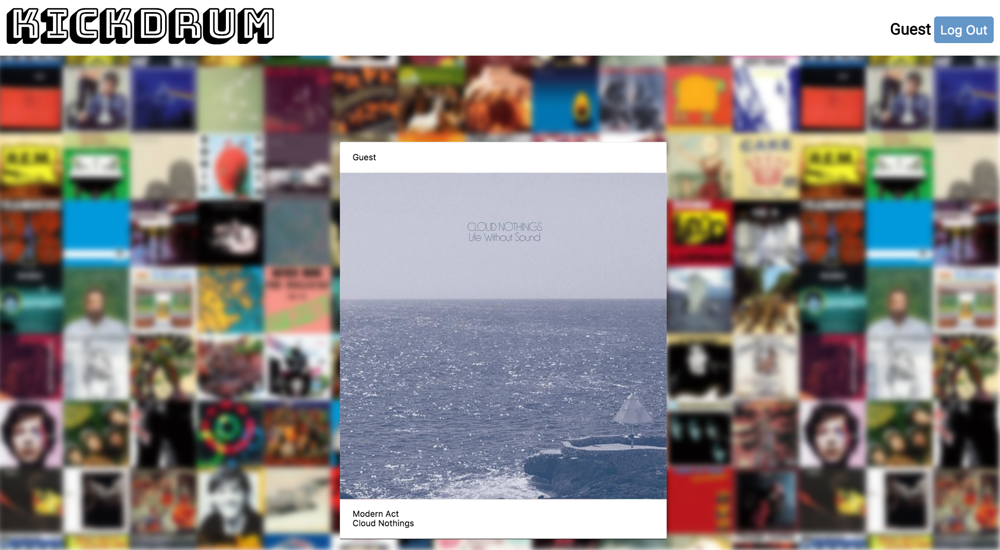
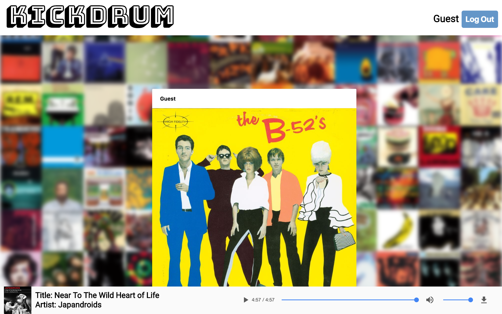
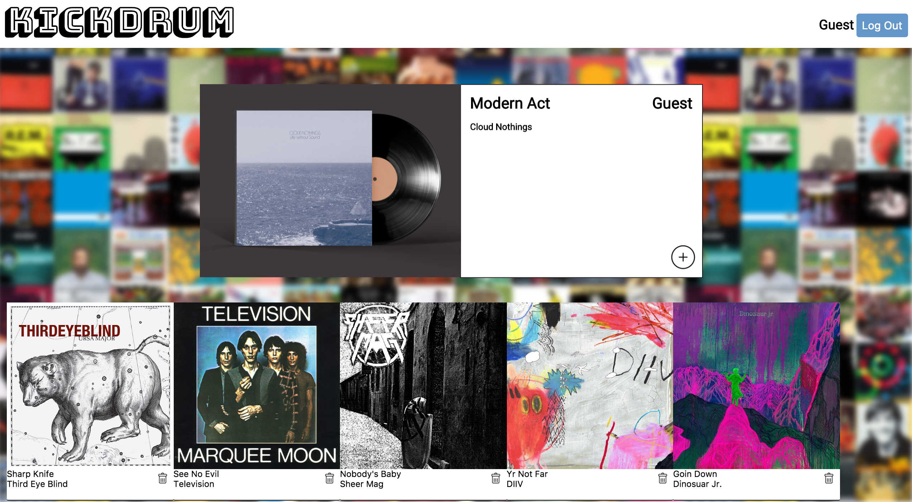

# KickDrum

[KickDrum Live][live] **NB:** This should be a link to your production site

[live]: hhttp://www.kickdrum.io

KickDrum is a full-stack web application inspired by Cymbal.fm.  It utilizes Ruby on Rails on the backend, a PostgreSQL database, and React.js with a Redux architectural framework on the frontend.  

## Features & Implementation

### Creating and Rendering Posts

  

  To create a new post, a user must provide basic info (`artist` and `title`) as well as a public `photo_url` of the album art and an mp3 link, `song_url`. All fields are required for creating a new post. Each post is stored in a Posts table which has a `user_id` for reference. Posts are rendered in four ways: as a PostIndexItem in the main feed (stream), as part of a grid view in user profile / user bookmarks, in a song player at the bottom of the page, and if a post is the most recent, in the ProfileHeader as a featured post. Upon navigating to each section, an API request is made to the posts database (with user params if necessary) to populate the specified component. In each postDetail, the post title, album, photo and bookmark button are displayed (see below:)

  

### Playing a Post

  In order to play the associated mp3 link for each post, users click the "play" icon which is visible onHover on a post's photo. Clicking the icon dispatches an action to the player reducer, which updates the player's props and displays artist name, title and begins playing the linked mp3. The player only re-renders when receiving new props, which allows uninterrupted play while users navigate to other pages. The player was built with react audio player library.

  

### Profiles

User profile holds the most recent user post in a "featured post" component, displaying the post like a vinyl album. All previous posts are kept in a scrollable
feed below the featured post. Each section is a subcomponent of a User Profile component.

### Future Feature Implementation

Plans include bookmarking capability and a bookmarks view in user profiles, queued
playlist for the music player, artist pages and user follows.
