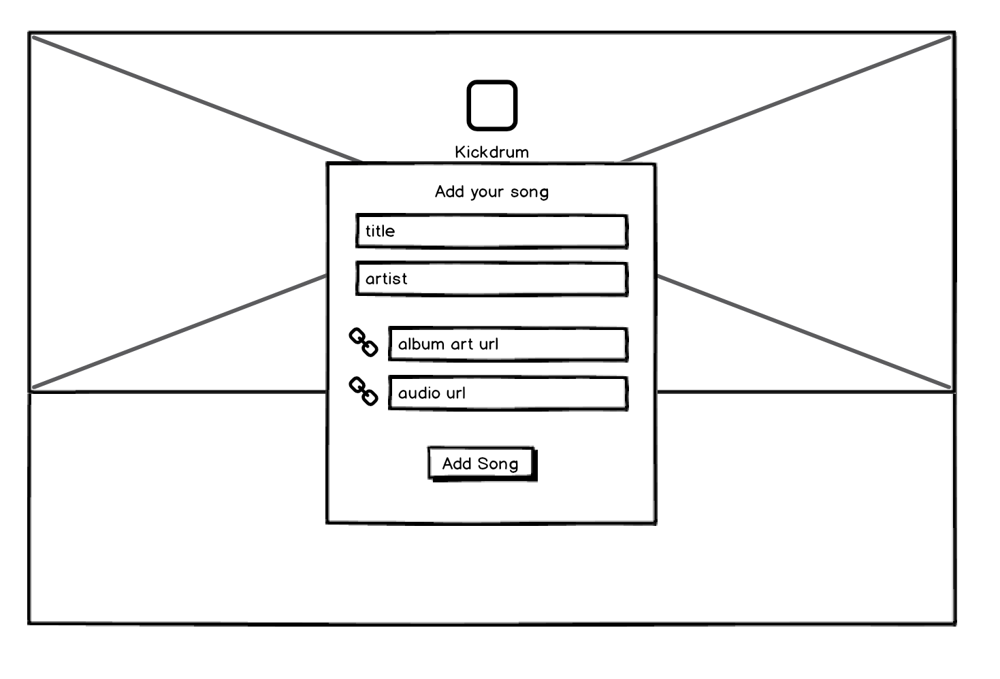
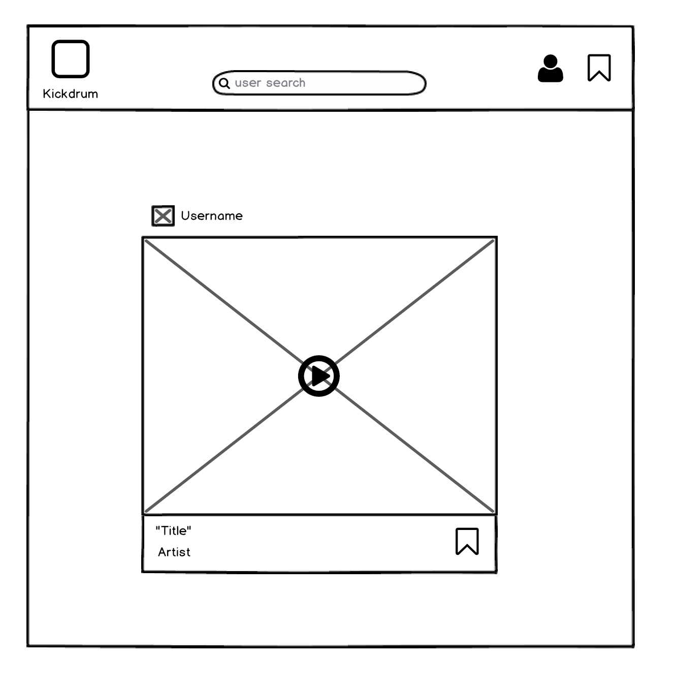

# KickDrum

[KickDrum Live][heroku] **NB:** This should be a link to your production site

[heroku]: http://www.herokuapp.com

KickDrum is a full-stack web application inspired by Cymbal.fm.  It utilizes Ruby on Rails on the backend, a PostgreSQL database, and React.js with a Redux architectural framework on the frontend.  

## Features & Implementation


### Creating and Rendering Posts


  

  To create a new post, a user must provide basic info (`artist` and `title`) as well as a public `photo_url` of the album art and an mp3 link, `song_url`. All fields are required for creating a new post. Each post is stored in a Posts table which has a `user_id` for reference. Posts are rendered in three ways: as a PostIndexItem in the main feed (stream), as part of a grid view in user profile / user bookmarks, and if a post is the most recent, in the ProfileHeader as a featured post. Upon navigating to each section, an API request is made to the posts database (with user params if necessary) to populate the specified component. In each postDetail, the post title, album, photo and bookmark button are displayed (see below:)

  


### Notebooks

Implementing Notebooks started with a notebook table in the database.  The `Notebook` table contains two columns: `title` and `id`.  Additionally, a `notebook_id` column was added to the `Note` table.  

The React component structure for notebooks mirrored that of notes: the `NotebookIndex` component renders a list of `CondensedNotebook`s as subcomponents, along with one `ExpandedNotebook`, kept track of by `NotebookStore.selectedNotebook()`.  

`NotebookIndex` render method:

```javascript
render: function () {
  return ({this.state.notebooks.map(function (notebook) {
    return <CondensedNotebook notebook={notebook} />
  }
  <ExpandedNotebook notebook={this.state.selectedNotebook} />)
}
```

### Tags

As with notebooks, tags are stored in the database through a `tag` table and a join table.  The `tag` table contains the columns `id` and `tag_name`.  The `tagged_notes` table is the associated join table, which contains three columns: `id`, `tag_id`, and `note_id`.  

Tags are maintained on the frontend in the `TagStore`.  Because creating, editing, and destroying notes can potentially affect `Tag` objects, the `NoteIndex` and the `NotebookIndex` both listen to the `TagStore`.  It was not necessary to create a `Tag` component, as tags are simply rendered as part of the individual `Note` components.  


## Future Directions for the Project

In addition to the features already implemented, I plan to continue work on this project.  The next steps for FresherNote are outlined below.

### Search

Searching notes is a standard feature of Evernote.  I plan to utilize the Fuse.js library to create a fuzzy search of notes and notebooks.  This search will look go through tags, note titles, notebook titles, and note content.  

### Direct Messaging

Although this is less essential functionality, I also plan to implement messaging between FresherNote users.  To do this, I will use WebRTC so that notifications of messages happens seamlessly.  
